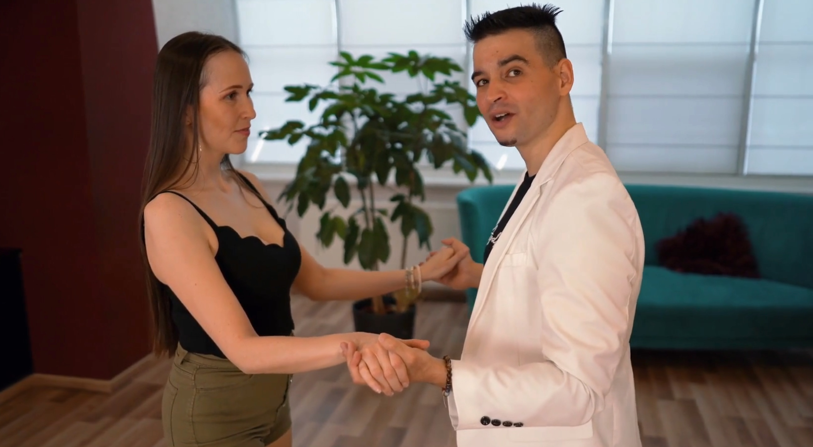

= Bachata
:toc: right
:toclevels: 5
:sectnums:
:sectnumlevels: 5

== Sessions

=== Session 1

* Side Basic
* Front and Back Basic
* Left Turn
* Right Turn
* In Place Basic
* Step and Tap
* Basic In All Directions (Horizontal, Vertical, Diagonal, Circular etc.)

=== Session 2

*Open Hold Parner Work and Semi Close Hold Partner Work*

* #Different Holds#
* Transition: Open & Semi Close Hold
* Side Basic
* Front and Back Basic
* Left Turn
* Right Turn
* In Place Basic
* Step and Tap

---

* Basic + 180 degree (rotation)
* Wrap
* Hammer Lock

##################################################

== Resources

https://www.youtube.com/playlist?list=PL5wtqicMLL7b333c0PyB0cH9Gd_6lsT9d[YouTube Playlist]

##################################################

== Hand Holds

image::img/open.png[Open Hold 1]

---

---

##################################################

== Bachata Tips

* Keep your knees slightly bent and relaxed.
* Move the hips naturally in the opposite direction of the step.
* Maintain a strong and stable frame.
* When turning the lady, keep your hand at her forehead level.

