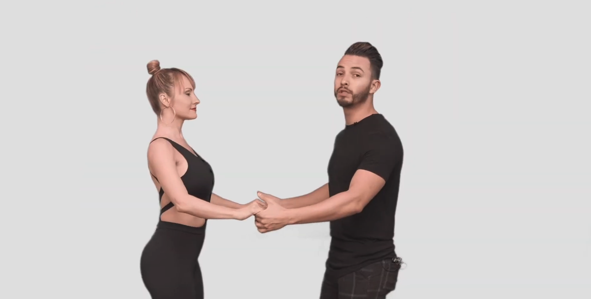
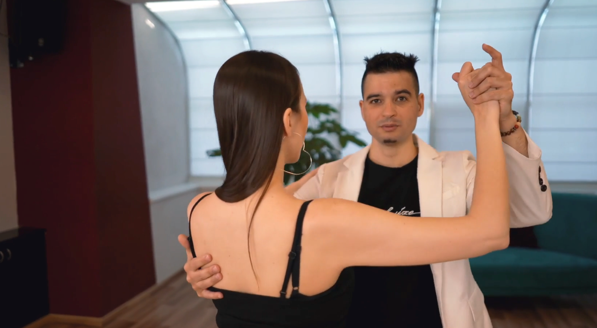

= Bachata
:toc: right
:toclevels: 5
:sectnums:
:sectnumlevels: 5

== Session

=== Session 1

* Side Basic
* Front and Back Basic
* Left Turn
* Right Turn
* In Place Basic
* Basic In All Directions (Horizontal, Vertical, Diagonal, Circular etc.)

##################################################

---

== Hand Holds

---

